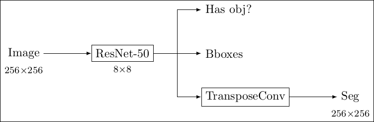
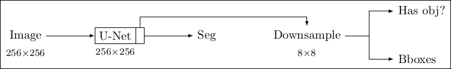

# Obj and Seg: 2in1

A couple of simplifications:
1. Only detecting bounding-boxes and segmentations of cars.
2. Only training with cases where we have both bounding-boxes and segmentations.

Two architectures are here implemented:

**Architecture SegHead:** We predict segmentation as a sequence of the object grid.

**Architecture ObjAfterSeg:** We predict objects from the layer before the segmentation output.

-- Ricardo Cruz <rpcruz@fe.up.pt>
